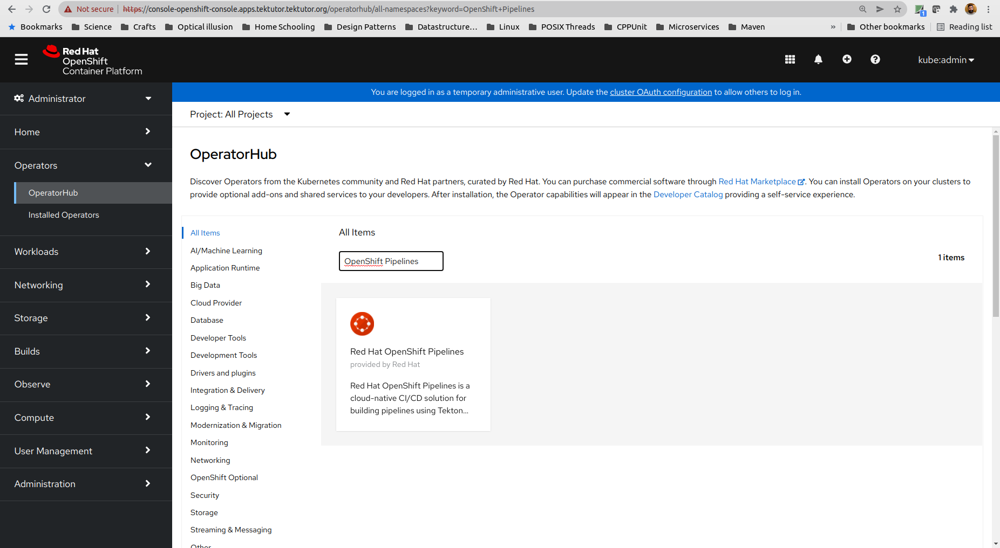
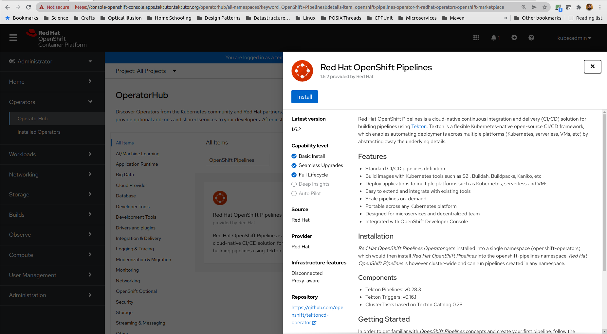
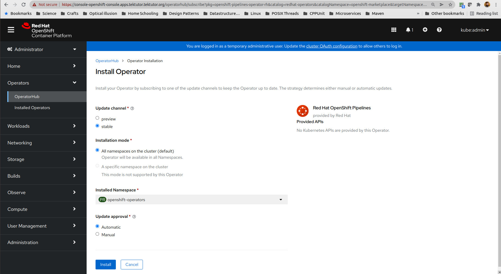
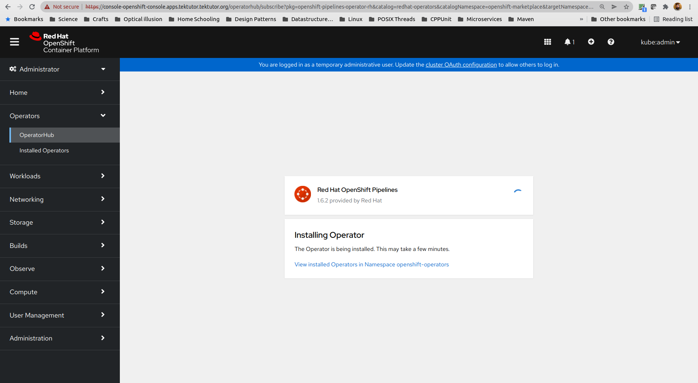
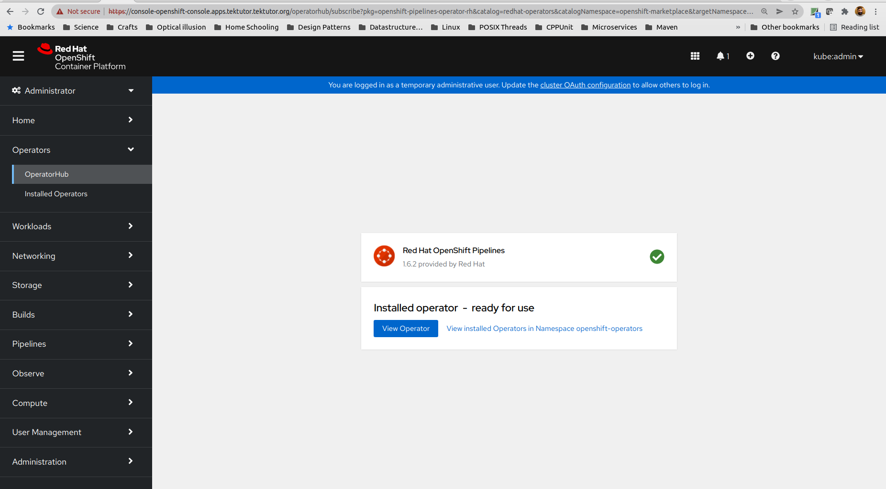
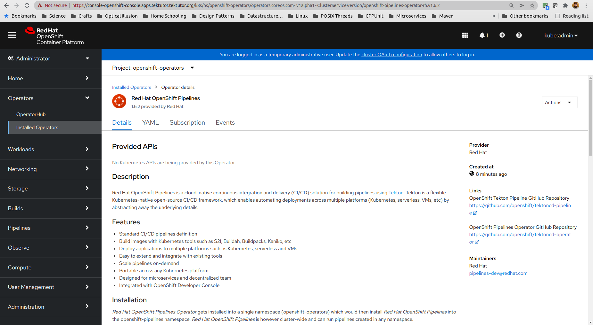
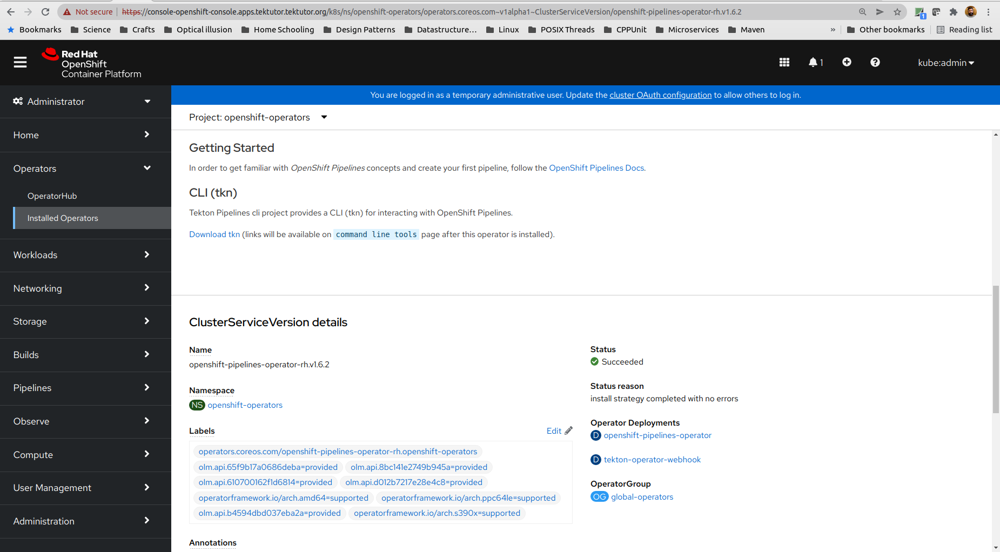

# ⛹️‍♂️ Lab - Installing a multi-pod WordPress with maridb application
```
oc delete project jegan
oc new-project jegan
oc new-app mariadb-ephemeral
oc new-app php~https://github.com/wordpress/wordpress
oc logs -f deploy/wordpress
oc expose svc/wordpress
oc get routes
```

When you click on the wordpress route, it would prompt for certain details
you need to give the database name shown in the terminal when you deployed mariadb

username - root
password - root password shown in the terminal
hostname - mariadb.ocp.svc.cluster.local

The hostname you need to replace it with the hostname you see in Administrator --> Networking --> Services --> mariadb --> Hostname

## What is a Custom Resource in Kubernetes/OpenShift ?
- an API extension mechanism in Kubernetes/OpenShift
- helps you add a new kind of object in your Kubernetes/OpenShift Cluster 
  just like Deployment, ReplicaSet, Pod, etc.,
- a Custom Resource Definition(CRD) defines a Custom Resource(CR)
- once a CR is created using CRD it can be accessed using kubectl or oc commands

## What is an Operator in Kubernetes/OpenShift?
Some references
https://kubernetes.io/docs/concepts/extend-kubernetes/operator/

- an Operator is a custom Kubernetes/OpenShift Controller that waches a CR
- Custom Controllers monitors CR, compares its desired with actual state, 
  if it deviates takes appropriate actions
- Operators helps
  - scaling up/down a Custom Resource
  - upgrading a CR from one version to another
  - engineers & developers who would like to extend Kubernetes API to manage their site 
    and software

## Operator Framework Choices
Charmed Operator Framework - https://juju.is/<br>
kopf - https://github.com/nolar/kopf<br>
Kubebuilder - https://book.kubebuilder.io/<br>
KubeOps - https://buehler.github.io/dotnet-operator-sdk/<br>
KUDO - https://kudo.dev/<br>
MetaController - https://metacontroller.github.io/metacontroller/intro.html<br>
Operator Framework - https://operatorframework.io/<br>
shell operator - https://github.com/flant/shell-operator<br>

## What is Operator SDK?
- builds on top of Kuberenetes controller-runtime libraries
- provides essential Kubernetes controller runtimes in Go programming lanaguage
- a set of tools that helps in developing, building and deploying an Operator into i
  Kubernetes/OpenShift

## What is Operator Lifecycle Manager (OLM) ?
- it takes the Operator pattern one level above by creating a OLM Operator which manages Operators
- it lets you define Operators declaratively

## What is Operator Metering?
- is used to analyze the resource usage of Operators running in Kubernetes/OpenShift
- CPU Usage, memory usage, and other metrics

## Tekton CI/CD Pipeline
- Tekton is an opensource knative application that helps you create CI/CD 
  pipeline within Kubernetes/OpenShift cluster.
- Tekton supports both Kubernetes and OpenShift
- is a set of custom kubernetes resources
- Available as an operator or can be installed via manifest files from CLI
- adds many custom resources
     Task
     Pipeline
     TaskRun
     PipelineRun
     Workspace
- comes with custom controllers to manage the above custom resources

## Installing Tekton within OpenShift Webconsole

🔴 Only one person can perform this task in a Cluster as Tekton is installed cluster wide. 🔴

From the OpenShift web console, switch to Administrator view.  Navigate to Operators --> OperatorHub Menu on the Left side as shown in the screenshot below. In the search text box, you need to type "OpenShift Pipelines" to narrow down the search


Select "Red Hat OpenShift Pipelines" and Click on Install button.


You may now click on the Install button

Once you Click on the Install button, you will be taken to below screen


Once the Installation is complete, it will take you the below page


You may now click on the View Operator button which then takes you to the final page.




Congratulations! you have installed Tekton in your OpenShift Cluster.

## Installing Tekton via CLI
```
oc new-project tekton-pipelines
oc adm policy add-scc-to-user anyuid -z tekton-pipelines-controller
oc adm policy add-scc-to-user anyuid -z tekton-pipelines-webhook
oc apply --filename https://storage.googleapis.com/tekton-releases/pipeline/latest/release.notags.yaml
```

## ⛹️‍♀️ Lab - Creating your very firt Tekton task
Create a file named hello.yml and paste the below content
<pre>
apiVersion: tekton.dev/v1beta1
kind: Task
metadata:
  name: hello
  namespace: tektutor 
spec:
  steps:
    - name: echo
      image: ubuntu
      command:
        - echo
      args:
        - "Hello World !"
</pre>

Now try creating the task as shown below
```
oc apply -f hello.yml
```
Expected output is
<pre>
(jegan@tektutor.org)$ <b>oc apply -f hello.yml</b>
task.tekton.dev/hello created
</pre>

You can try listing the task
```
tkn task list
oc get tasks
```
Expected output is
<pre>
(jegan@tektutor.org)$ <b>tkn task list</b>
NAME    DESCRIPTION   AGE
hello                 13 seconds ago
(jegan@tektutor.org)$ <b>oc get tasks</b>
NAME    AGE
hello   23s
</pre>

You can try to find more details about the task
```
oc describe task/hello
```
Expected output is
<pre>
(jegan@tektutor.org)$ <b>oc describe task/hello</b>
Name:         hello
Namespace:    tektutor
Labels:       <none>
Annotations:  <none>
API Version:  tekton.dev/v1beta1
Kind:         Task
Metadata:
  Creation Timestamp:  2022-03-29T06:59:19Z
  Generation:          1
  Managed Fields:
    API Version:  tekton.dev/v1beta1
    Fields Type:  FieldsV1
    fieldsV1:
      f:metadata:
        f:annotations:
          .:
          f:kubectl.kubernetes.io/last-applied-configuration:
      f:spec:
        .:
        f:steps:
    Manager:         kubectl-client-side-apply
    Operation:       Update
    Time:            2022-03-29T06:59:19Z
  Resource Version:  606975
  UID:               32c0cbd4-f37e-4722-b316-c55f4093c66d
Spec:
  Steps:
    Args:
      Hello World !
    Command:(jegan@tektutor.org)$ <b>oc describe task/hello</b>
Name:         hello
Namespace:    tektutor
Labels:       <none>
Annotations:  <none>
API Version:  tekton.dev/v1beta1
Kind:         Task
Metadata:
  Creation Timestamp:  2022-03-29T06:59:19Z
  Generation:          1
  Managed Fields:
    API Version:  tekton.dev/v1beta1
    Fields Type:  FieldsV1
    fieldsV1:
      f:metadata:
        f:annotations:
          .:
          f:kubectl.kubernetes.io/last-applied-configuration:
      f:spec:
        .:
        f:steps:
    Manager:         kubectl-client-side-apply
    Operation:       Update
    Time:            2022-03-29T06:59:19Z
  Resource Version:  606975
  UID:               32c0cbd4-f37e-4722-b316-c55f4093c66d
Spec:
  Steps:
    Args:
      Hello World !
    Command:
      echo
    Image:  ubuntu
    Name:   echo
Events:     <none>

      echo
    Image:  ubuntu
    Name:   echo
Events:     <none>
</pre>

## Running the Task

We need to create a TaskRun to run the Task.  
You can achieve this either by writing a TaskRun manifest(yaml) file or via this command
```
tkn task start hello
```

Expected output is
<pre>
(jegan@tektutor.org)$ tkn task start hello
TaskRun started: hello-run-bdj8j

In order to track the TaskRun progress run:
tkn taskrun logs hello-run-bdj8j -f -n tektutor
</pre>

You may now check the output of the TaskRun as shown below
```
tkn taskrun logs hello-run-bdj8j -f -n tektutor
```

Expected output is
<pre>
(jegan@tektutor.org)$ tkn taskrun logs hello-run-bdj8j -f -n tektutor

[echo] Hello World !
</pre>
